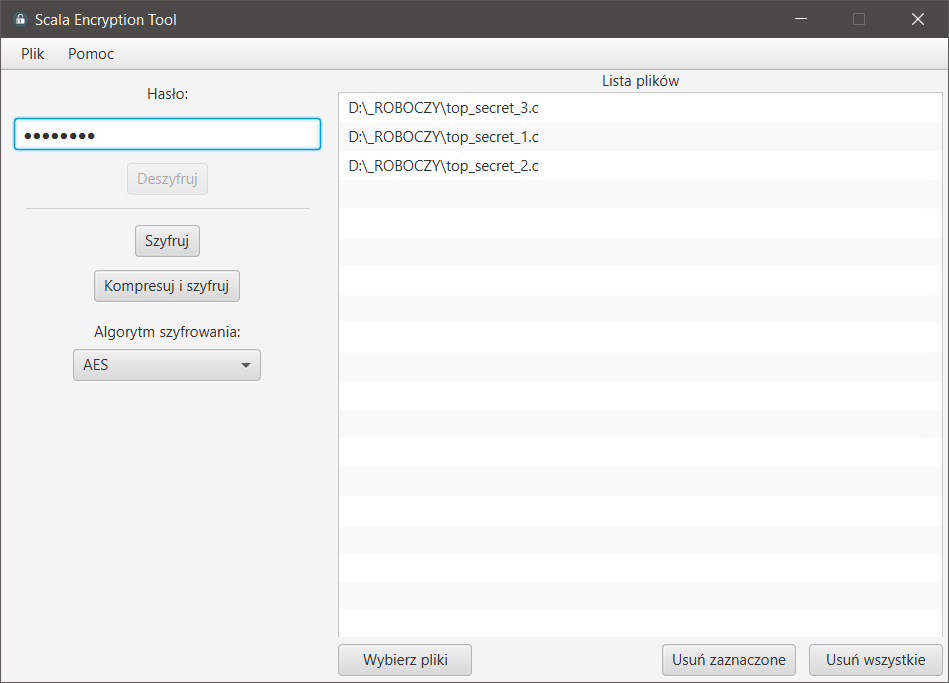
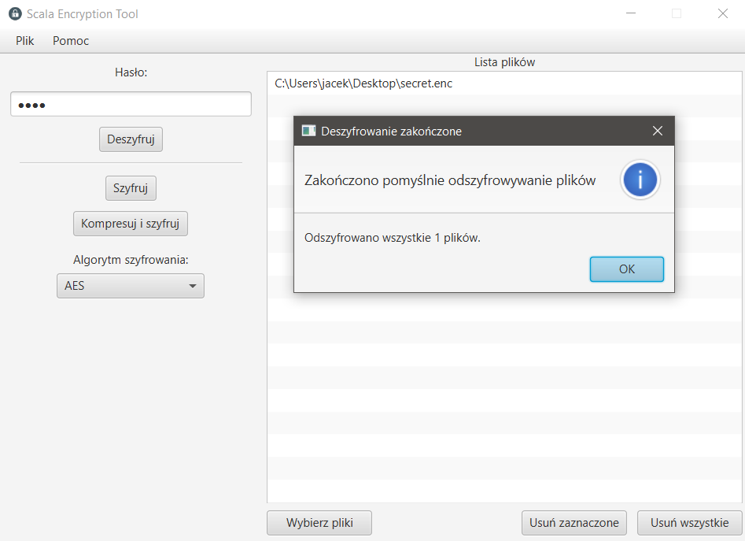

# Scala Encryption Tool

## About app

Application to encrypt/decrypt files and pack files into encrypted archives. Created using Scala and JavaFX GUI library. The app was made as a project for *Programming in Scala* classes. 

## Functionality

Application contains the following features:

- Encrypt multiple files using safe AES or Blowfish algorithm.
- Create encrypted archive containing all files in compressed version.
- Decrypt multiple files with control sum verification.
- Easy - drag and drop - file management

## Screenshots

### Encryption view

### Successful decryption window

## Authors

- [kuczi55](https://github.com/kuczi55)
- [Jck-eN](https://github.com/Jck-eN)